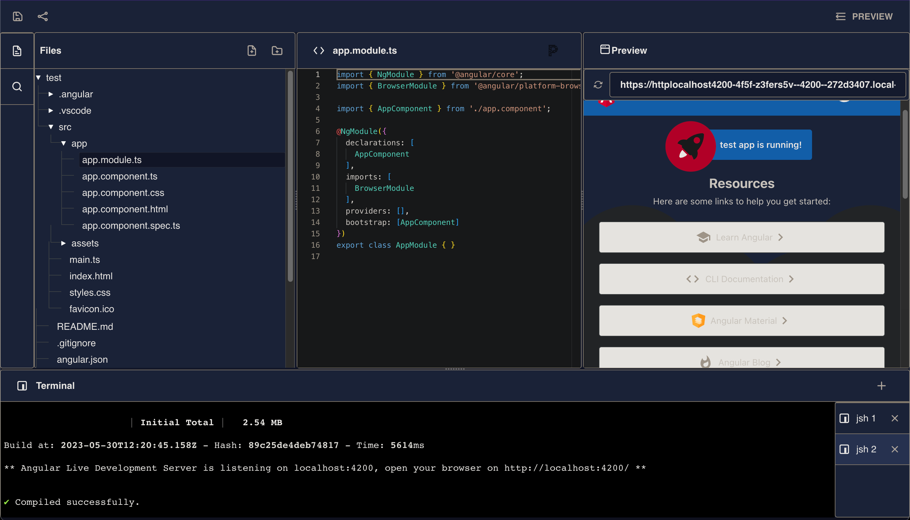

# Online code editor

This project was created as part of the work on my diploma

## Features

* Run any Node.js app directly inside your browser using WebContainers technology
* File tree manager to convenient work with project files and folders
* Multiple terminals
* Search files panel
* Instant project preview
* Code autocompletion with CodeT5 Typescript fine-tuned model
